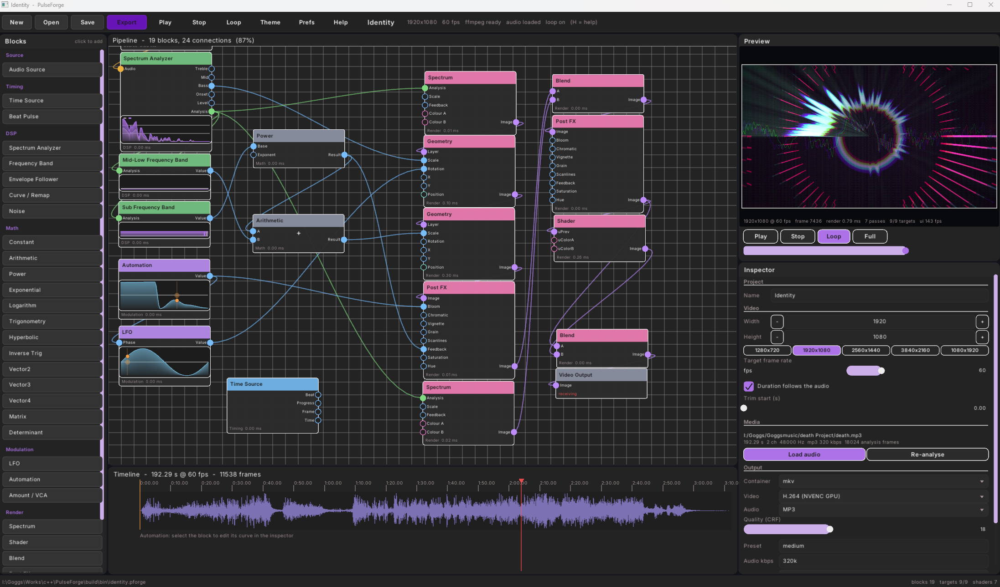

# PulseForge

A programmable, lightweight, fast, audio-reactive video synthesiser. Load any audio file ffmpeg can
read, patch a flow graph of DSP, modulation, timing, shader and geometry blocks,
watch it render live, then export it to any container/codec ffmpeg supports.



## Developmental Notes

This project is built with deepseek-flash under manual supervision.
The app is still in early stages, so expect minor bugs.

## Contents

- [What it does](#what-it-does)
- [Requirements](#requirements)
- [Building](#building)
- [Running](#running)
- [The editor](#the-editor)
- [The block reference](#the-block-reference)
- [Writing shaders](#writing-shaders)
- [Exporting](#exporting)
- [Project files](#project-files)
- [How it works](#how-it-works)
- [Verification](#verification)

## What it does

- **Any\* input format.** Audio is decoded through ffmpeg, so wav/mp3/flac/ogg/
  m4a/opus/aiff/... all work, at any sample rate or channel count. The clip is
  decoded once to 32-bit float for analysis and preview, **at the rate it was
  recorded at** (nothing is resampled on import). Files above 100 MB or
  192 kHz are rejected with an explanation, and the export rate is a project
  setting that defaults to 48 kHz.
- **Imported audio keeps its quality.** The import sets the export encoder and
  bitrate to match the source (mp3 stays libmp3lame at the same kbps, flac stays
  flac, opus stays libopus in containers that carry it...). When this ffmpeg
  build has no encoder for the source, the decoded audio is converted to AAC
  **in memory** at the best bitrate the format carries and that stream is copied
  out during export, so nothing is encoded twice.
- **Visualized Programmable pipeline.** A flow graph of blocks with typed ports.
  Connections are type-checked and cycles are rejected.
- **GPU rendering.** Blocks render through OpenGL 3.3 render targets. Shader
  blocks run your own `.glsl` files, while Spectrum uses one of the built-in effects.
- **Real automation.** Every automation block owns a keyframed curve that you
  edit inside the block itself, with a unipolar (0..1) / bipolar (-1..1) switch,
  and drive any scalar input, including other modulation blocks.
- **Real export.** Frames are rendered off-screen at the project resolution and
  piped to ffmpeg as raw RGBA, so MP4/H.264, WebM/VP9, MKV, MOV and AVI all work
  with a single code path. The soundtrack is whatever is patched into the
  **Audio Output** terminal: a direct link from the Audio Source muxes the
  original file with its matched encoder, while a Dynamics, ADC/DAC or any
  other processing chain is rendered by the graph first. An unconnected Audio
  Output exports a silent video.
- **Drag and drop.** Drop an audio file or a `.pforge` project onto the window.
  Audio above 100 MB or above 192 kHz is refused with an explanation,
  I guess realtime for this kind of quality is absurd,
  but you can remove this for experiments.
- **Preferences.** A preferences dialog holds the startup theme and the GUI
  scaling factor, next to the project's own information and metadata.

## Requirements

- Windows with an OpenGL 3.3 capable GPU (developed and verified on a GTX 1660 Ti).
- MinGW-w64 GCC 11 or newer or MSVC.
- CMake 3.20+ and Ninja.
- `ffmpeg` and `ffprobe` on `PATH` (the WinGet build is picked up automatically).
- [CrystalGUI](https://github.com/anstropleuton/crystalgui) sources, including
  its raylib submodule. The build looks for `third_party/crystalgui` first and
  then for the sibling checkout `../crystalgui`.

## Building

```powershell
cd build
cmake -S .. -B . -G Ninja
cmake --build . --parallel
```

The executable lands in `build/bin/PulseForge.exe`. The post-build step copies
`assets/` (shader presets) and the CrystalGUI `resource/` folder (fonts and the
box shader) next to it, because CrystalGUI resolves those relative to the
working directory.

Useful cache options:

| Option | Default | Meaning |
| --- | --- | --- |
| `CRYSTALGUI_DIR` | `../crystalgui` | Where the CrystalGUI checkout lives |
| `PF_BUILD_APP` | `ON` | Build the editor |
| `PF_BUILD_TOOLS` | `ON` | Build the diagnostic tools (`pf_selftest`, `pf_probe`, `pf_stage`) |

## Running

```powershell
cd build/bin
./PulseForge.exe                     # start empty, then load audio
./PulseForge.exe yourTrack.flac          # start with audio loaded
./PulseForge.exe project.pforge      # open a saved project
./PulseForge.exe --shot out.png track.wav           # off-screen capture of the editor
./PulseForge.exe --size 2560x1440 --shot ui.png     # capture at a specific size
```

The `--shot` mode renders the whole editor into an off-screen target and writes
a PNG, which is how the UI is regression-checked without a human at the screen;
`--hidden` keeps the window out of the way and `--size WxH` picks the capture
resolution. `--shot-frames N` and `--shot-delay S` decide how long to wait
before capturing (useful when the layout is being exercised).

The window opens at a size derived from the monitor - on a 2560x1440 display
it opens at 2201x1267, centred. Everything in the layout is recomputed from the
window size every frame, so dragging the window edge reflows the editor live:
2K and 4K screens simply get more canvas, a bigger preview and a taller
inspector.

## The editor

```
┌────────────┬──────────────────────────────────────┬──────────────┐
│ top bar    │ New Open Save Export Play Stop ...   │              │
├────────────┼──────────────────────────────────────┼──────────────┤
│ palette    │ graph canvas                         │ preview      │
│ (add block)│  pan: middle drag or space+drag      ├──────────────┤
│            │  zoom: wheel, drag blocks,           │ inspector    │
│            ├──────────────────────────────────────┤ (parameters) │
│            │ timeline: waveform, automation lanes │              │
├────────────┴──────────────────────────────────────┴──────────────┤
│ status bar                                                       │
└──────────────────────────────────────────────────────────────────┘
```

Interaction:

- **Palette** - click a block to add it to the canvas.
- **Canvas** - drag a block by its header, drag from an output port to an input
  port of the same colour to connect, right-click an input port to disconnect,
  wheel to zoom, middle-drag (or space+drag) to pan, `Del` to delete the
  selected block. Blocks that carry a live signal draw it in their own body:

  | Block | In-block display |
  | --- | --- |
  | Audio Source | 0.1 s waveform window following the playhead |
  | Spectrum Analyzer | logarithmic spectrum, dry signal behind, gained + gated signal in front |
  | Frequency Band | scrolling input/output bar with current-value markers |
  | LFO | one cycle of the waveform with a pivot travelling along it |
  | Automation | the keyframed curve with a pivot travelling along it |

  The previews read the same analysis and evaluation results the renderer uses,
  so what they show is what drives the video. They are deliberately cheap: the
  spectrum is reduced to 64 columns, the band keeps a 48 sample history, curves
  are sampled at 72 points, and each series is emitted as a single batched draw.
- **Preview** - play/pause, stop, loop, and a resolution scale that only affects
  the interactive preview, never the export.
- **Timeline** - click/drag in the ruler or waveform to scrub.
- **Inspector** - with a block selected it shows that block's parameters grouped
  by section; with nothing selected it shows project metadata (resolution, frame
  rate, duration, output format) and the audio file. Resolution uses exact
  numeric entry rather than sliders. `Automation` blocks show their curve here:
  click to add a key, drag to move, right-click to delete.

Shortcuts: `Space` play/pause, `Ctrl+S` save, `Ctrl+O` open, `Ctrl+N` new,
`Ctrl+E` export, `Ctrl+,` (or `F2`) preferences, `Del` delete block,
`F5` reload shaders from disk, `H` help.

The window title shows the project name and adds `*` while there are unsaved
changes.

### Preferences

The **Prefs** button (or `Ctrl+,`) opens a dialog with:

- **Default theme** - dark or light, applied at startup.
- **GUI scaling** - 0.75x to 2x. Every widget metric, panel size and label is
  multiplied by it, which is also the knob for making the text larger or
  smaller.
- **Project information and metadata** - project name, target resolution,
  target frame rate, duration (following the audio or fixed), output container,
  codec pair, quality (CRF), audio bitrate, output sample rate (48 kHz by
  default) and encoder preset.

Appearance settings are written to `pulseforge_preferences.json` next to the
executable when *Save preferences* is pressed.

### Editor behaviour worth knowing

- **Sliders** can be dragged, or **double-clicked** to type an exact value.
  Whatever you enter is clamped to the slider's range and the handle jumps to
  match.
- **Frequency sliders are logarithmic**: the Low/High Hz controls in Frequency
  Band map the track the way the ear and the analysis bands divide the
  spectrum, and their readouts are whole Hz instead of scientific notation.
- **GPU encoding is available per project**: the Output section's *Video* row
  lists the encoders this ffmpeg build carries for the chosen container, with
  the GPU families marked (NVENC, Quick Sync, AMF) next to the CPU ones. The
  choice is stored in the project file (`output.videoCodec`) and each family
  gets the right quality options (CRF for x264/x265/SVT-AV1, `-cq` for NVENC,
  `-global_quality` for Quick Sync, `-qp_i/-qp_p` for AMF). Before a GPU export
  starts the encoder is probed once; if the machine cannot run it, you are
  offered the software fallback instead of a failed render.
- **The audio encoder is a project setting too**: the Output section's *Audio*
  row offers the encoders the container can mux and this ffmpeg build carries
  (AAC, Opus, Vorbis, FLAC, ALAC, MP3, AC-3, E-AC-3, PCM). Importing audio picks
  the matching encoder automatically - with one exception: a PCM file imported
  into a Matroska project becomes **FLAC** instead of raw PCM, because many
  players decode PCM-in-MKV to silence (and it is twice the size). Matroska now
  defaults to AAC for the same compatibility reason; FLAC and Opus are one click
  away when you want them.
- **Dropdown lists** scroll with the wheel and show a scroll bar when the
  enumeration is longer than the box; options never spill outside it.
- **While a dialog or list is open**, everything behind it stops responding to
  clicks and hover, including the CrystalGUI chrome buttons.
- **Preview playback follows the Audio Output**: a direct link from the Audio
  Source streams the decoded clip, a processed chain (Dynamics, ADC -> DAC, ...)
  is rendered live one video frame at a time and streamed in small sub-buffers,
  and an unconnected Audio Output plays silence while the video keeps running.
  The audio chain follows the video frame clock, so rewiring the graph or moving
  a slider is heard immediately and the Spectrum Analyzer analyses the same
  freshly rendered window; seeking and looping restart the stream at the new
  position.
- **Starting an export reminds you** when the configured audio bitrate is far
  below the imported file (below 80%), with the source and target rates spelled
  out; *Continue* renders anyway and *Cancel* returns to the dialog.
- **Inspector descriptions** are drawn with the same atlas-backed font as the
  rest of the UI and wrap to the panel width, with the height measured instead
  of estimated - they stay readable (and complete) at every GUI scale. The same
  applies to dialog messages and the help overlay, which scrolls when it does
  not fit.
- **Color fields** open an HSV picker: a hue/saturation wheel with a pivot, a
  black-to-full-value bar with its own pivot, and RGB/HSV boxes underneath that
  stay in sync with the pivots in both directions. *Select* keeps the colour,
  *Cancel* (or Escape) restores the previous one, and clicking anywhere else
  behaves like *Select*.
- **Vector ports widen automatically**: a Vector2 or Vector3 output can be
  plugged into a Vector4 input, with the missing components filled with 0, and
  Vector2 into Vector3 the same way.

## The block reference

### Source

| Block | Inputs | Outputs | Notes |
| --- | --- | --- | --- |
| Audio Source | - | Audio | Emits the project's decoded clip |

### Timing

| Block | Inputs | Outputs | Notes |
| --- | --- | --- | --- |
| Time Source | - | Time, Frame, Progress, Beat | Video timing: seconds, frame index, 0..1 progress, beat phase |
| Beat Pulse | Tempo, Decay, Offset | Pulse | Decaying trigger on a musical division; the tempo input shifts the rate by octaves, decay scales and offset nudges the phase (0.25 s per unit) |

### DSP

| Block | Inputs | Outputs | Notes |
| --- | --- | --- | --- |
| Spectrum Analyzer | Audio | Analysis, Level, Onset, Bass, Mid, Treble | Analyses its own Audio input: the imported clip uses its whole-file analysis, a processed stream (Dynamics, DAC, ...) is measured live every frame, and an unconnected input outputs silence |
| Frequency Band | Analysis | Value | Log-frequency range with average/peak/sum, shaping and attack/release |
| Envelope Follower | Scalar | Scalar | Attack/release, threshold, gain, floor |
| Curve / Remap | Scalar | Scalar | Input range to output range with power, smoothstep and clamping |
| Dynamics | Audio, Pre-gain, Threshold, Ratio, Attack, Release, Post-gain | Audio | Zero-latency single-band compressor / downward expander with an optional 0 dBFS limiter (Hard Clip or Soft Clip and independent attack/release). The block draws dry and wet loudness in a 4:3 dBFS graph; the modulation ports follow the usual conventions (levels scale by `1 + input`, threshold adds 24 dB per unit, times shift by octaves) |
| ADC | Audio | left, right, ... | Starts an audio-rate region: each channel becomes a Scalar stream at the audio sample rate, so Math, Modulation, Timing and Debug blocks between it and a DAC process every sample (x2.0838 then tanh is real saturation, not a gain). `Channels` defaults to 2 (left/right) and can be 1..8 |
| DAC | left, right, ... | Audio | Ends an audio-rate region and converts the per-channel Scalar streams back to Audio at the same rate. An unconnected channel follows the first connected one, so legacy single-port chains stay dual-mono. `Channels` defaults to 2 |

### Math

| Block | Inputs | Outputs | Notes |
| --- | --- | --- | --- |
| Constant | - | Scalar | Fixed value |
| Arithmetic | A, B | Result | add, subtract, multiply, divide, min, max, modulo, with gain/offset and clamping |
| Power | Base, Exponent | Result | Negative bases keep their sign instead of becoming NaN |
| Exponential | X | Result | e^x, 2^x or 10^x |
| Logarithm | X | Result | ln, log2 or log10, with an input floor |
| Trigonometry | X | Sin, Cos, Tan | radians/turns/degrees, frequency and phase |
| Hyperbolic | X | Sinh, Cosh, Tanh | tanh doubles as a soft clipper |
| Inverse Trig | X | Asin, Acos, Atan | input clamped for arcsin/arccos, output in radians/turns/degrees |
| Vector2 | X, Y | Vector2, X, Y | components are also exposed as scalars |
| Vector3 | X, Y, Z | Vector3, X, Y, Z | |
| Vector4 | X, Y, Z, W | Vector4, X, Y, Z, W | |
| Matrix | Row 0..3 (Vector4) | Matrix | 2x2, 3x3 or 4x4, edited as a grid of numeric boxes; a connected Vector4 row overwrites that row |
| Determinant | Matrix | Determinant, Trace | of the top-left 2x2/3x3/4x4 block |
| Noise | - | Scalar | Value noise, sample & hold or pink-ish, 0..1 (Math because it takes no Audio/Analysis input) |

Arithmetic, Automation, Matrix and Determinant show a symbol in the middle of
their block (`+`, `-`, `x`, `/`, `<=`, `>=`, `%`, `0..1`, `+/-`, `3x3`) so the
pipeline can be read without opening the inspector.

Vector and matrix outputs are consumed by the `uVector2/3/4` and `uMatrix`
inputs of a **Shader** block whose file declares them, and by the **Position**
input on **Geometry**.

### Modulation

| Block | Inputs | Outputs | Notes |
| --- | --- | --- | --- |
| LFO | Phase, Frequency, Amplitude, Offset | Value | sine/triangle/saw/square/random, free-running or tempo-synced; the frequency input shifts by octaves, amplitude scales and offset is added |
| Automation | Depth, Offset | Value | Keyframed curve edited in the block; unipolar 0..1 or bipolar -1..1, with modulatable depth/offset |
| Amount / VCA | In, Amount, Gain, Offset | Out | Scales a signal by a constant or by a second modulation input, with quantising; gain scales and offset is added |
| Ringbuffer | In, Speed | Input, Average, Buffer | Records the scalar into a loop buffer of 2..1024 samples; `Input` is the live value, `Average` the running average of the buffer and `Buffer` the sample the looping read pointer (loops/second, octave modulation) is passing over. The block draws the buffer with the read position marked |
| Signal Filter | In, Cutoff, Resonance | Out | Zero-latency RBJ biquad (transposed direct form II) in low pass, high pass or band pass. Its sample rate is the current evaluation rate: the project frame rate for modulation, or the audio sample rate inside an ADC -> DAC region; the cutoff and resonance inputs shift by octaves. The block draws its own frequency response with a pivot you can drag to set cutoff (x, logarithmic) and resonance (y, Q = 10^(dB/20)) |

Modulated parameters are live: the inspector handles (and the Signal Filter's
response plot, the Ringbuffer's read marker, and so on) follow the value the block
actually used, so an LFO visibly moves the control it is patched into. Dragging a
slider shows its base value while the drag lasts, then returns to the modulated
readout.

### Debug

| Block | Inputs | Outputs | Notes |
| --- | --- | --- | --- |
| VU / Digital Meter | In | Out | Pure pass-through that shows the value either as a classic VU meter (0 VU = **-18 dBFS**, fast attack/slow release, peak-hold tick) or as a 4-second value/time diagram |
| Guard | In | Out | Silences non-finite scalars: NaN and +/-Inf become 0. Three lamps flash for +Inf, -Inf and NaN, labelled with the matching symbols |

### Render

| Block | Inputs | Outputs | Notes |
| --- | --- | --- | --- |
| Spectrum | Analysis, Scale, Feedback, Colour A/B | Image | Draws the analysis with a built-in spectrum effect; the Scale/Feedback/Colour inputs modulate the matching parameters |
| Shader | uPrev, ...derived | Image | Applies a `.glsl` file to the incoming image; the ports follow the uniforms the file uses (`uPrev`, `uInput2`, `uUser[0..7]`, `uColorA/B`, `uVector2/3/4`, `uMatrix`). Compile errors are reported on the block instead of silently falling back |
| Blend | A, B | Image | Cross fade, add, screen, multiply, difference, overlay, min, max |
| Post FX | Image, 8 scalars | Image | Bloom, chromatic aberration, vignette, grain, scanlines, feedback, saturation, hue |
| Geometry | Layer, Scale, Rotation, X, Y | Image | Circle, ring, radial bars, bar spectrum, waveform ring/line, polygon grid, sparks, orbit, text |

### Output

| Block | Inputs | Outputs | Notes |
| --- | --- | --- | --- |
| Video Output | Image | - | Terminal block; whatever reaches it is previewed and exported |
| Audio Output | Audio | - | Terminal block; the signal connected here is the only audio the export carries. Unconnected exports a silent video |

## Writing shaders

The **Shader** block points at a `.glsl` file (the file picker in the inspector
writes the path into the block) and applies it to the incoming image. Its input
ports are **derived from the file**: only the uniforms the source actually uses
get a port, so a shader that reads `uUser[0]`, `uUser[1]` and both colours shows
exactly those four inputs next to `uPrev`. Changing the file (or pressing
*Reload shaders*) rebuilds the ports; links are matched by uniform name.

If the file does **not** start with `#version`, the PulseForge preamble is
prepended, so the body only needs a `main()` that writes `finalColor`.

```glsl
// assets/shaders/my_effect.glsl
void main() {
    vec2 uv = pfUv();                       // (0,0) top-left, (1,1) bottom-right
    vec3 src = pfPrev(uv).rgb;              // upstream image
    float mag = pfSpectrum(uv.x);           // 1D log-frequency spectrum, 0..1
    float wave = pfWave(uv.x);              // 1D waveform, -1..1
    vec3 col = src + mix(uColorA.rgb, uColorB.rgb, mag) * mag;
    col += uBass * 0.5 + uUser[0] * 0.25;   // scalar ports land in uUser[]
    finalColor = vec4(col, 1.0);
}
```

Available in the preamble:

| Kind | Names |
| --- | --- |
| Samplers | `uPrev`, `uInput2`, `uFeedback` (previous frame of this block), `uSpectrum`, `uWaveform`, `texture0` |
| Timing | `uTime`, `uFrame`, `uDuration`, `uProgress` |
| Audio | `uBass`, `uMid`, `uTreble`, `uLevel`, `uOnset`, `uBeat` |
| User | `uUser[8]`, `uColorA`, `uColorB`, `uVector2`, `uVector3`, `uVector4`, `uMatrix` |
| Helpers | `pfUv()`, `pfPrev()`, `pfInput2()`, `pfFeedback()`, `pfSpectrum()`, `pfSpectrumBand()`, `pfWave()`, `pfRotate()`, `pfHash()`, `pfNoise()`, `pfFbm()`, `pfHsv2Rgb()` |

Shaders that declare `#version` themselves are compiled verbatim, which is the
escape hatch for porting existing GLSL (see
`assets/shaders/minimal_selfcontained.glsl`).

Built-in effects live on the **Spectrum** block (Analysis in, Image out):
`passthrough`, `solid`, `gradient`, `plasma`, `radial_spectrum`, `bars`,
`waveform_scope`, `spectrogram`, `tunnel`, `kaleidoscope`, `starfield`, `bloom`,
`chromatic`, `feedback_trail` and `vignette`. `blend` and `postfx` are internal
effects used by their own blocks.

Projects saved before the split keep loading: a `shader.pass` node with a file
becomes a Shader block (its ports rebuilt from the file, links re-matched by
name), one without a file becomes Spectrum and is wired to the project's
Spectrum Analyzer.

Shader files are hot-reloadable: edit and press `F5` (or use *Reload shaders* in
the inspector).

## Exporting

The export dialog shows the exact ffmpeg command before running. Frames are
rendered into an off-screen target, read back through a double-buffered pixel
buffer object so the GPU copy of frame *n* overlaps with the CPU upload of frame
*n-1*, and written into ffmpeg's stdin as `rawvideo rgba`. Nothing is written to
disk in between.

Container presets:

| Container | Video | Audio | Notes |
| --- | --- | --- | --- |
| mp4 | libx264 (CRF) | aac | `+faststart` |
| webm | libvpx-vp9 | libopus | row-mt, cpu-used 2 |
| mkv | libx264 | libopus | |
| mov | libx264 | aac | `+faststart` |
| avi | mpeg4 (qscale) | libmp3lame | |

The **Audio Output** block decides the soundtrack. A direct link from the Audio
Source is taken from the original file with `-ss <trim start>`, so it is encoded
exactly once. Anything else (Dynamics, DAC, a processed chain) makes the graph
render the track first: it is evaluated once before the video starts, one video
frame at a time so modulations apply, and the result is written to a temporary
32-bit float WAV that ffmpeg muxes. A missing or unconnected Audio Output exports
no audio track at all (`-an`). `-shortest` keeps the mux in step with the video;
the preview monitor plays the same route, so what you hear while editing is what
the export will mux.

`pf_selftest` exercises this path end to end:

```powershell
cd build/bin
./pf_selftest.exe                       # synthesises a test wav, exports, probes the result
./pf_selftest.exe track.flac out.mp4 10 1920 1080
```

## Project files

`.pforge` files are JSON (written by a small in-tree writer/parser, no external
dependency):

```json
{
  "application": "PulseForge",
  "version": 1,
  "name": "Untitled",
  "video":  { "width": 1920, "height": 1080, "fps": 60, "useAudioDuration": true, "duration": 30 },
  "output": { "container": "mp4", "videoCodec": "libx264", "audioCodec": "aac", "crf": 18, "preset": "medium", "audioSampleRate": 48000 },
  "media":  { "path": "track.flac", "duration": 231.4, "sampleRate": 48000, "channels": 2,
              "codec": "flac", "bitRate": 912000, "transcodedAac": false },
  "view":   { "panX": 40, "panY": 40, "zoom": 1, "selectedNode": 10, "playhead": 12.5 },
  "blocks": [ { "id": 1, "kind": "src.audio", "x": 0, "y": 60, "enabled": true, "params": {} } ],
  "connections": [ { "from": 1, "fromPort": 0, "to": 2, "toPort": 0 } ]
}
```

Media paths are stored relative to the project file when possible, so moving
the project and its audio together keeps working. Blocks are stored by their
registry kind, and unknown parameters are ignored, so older files keep loading
when a block gains new parameters.

Projects saved before the Audio Output block existed are upgraded on load: an
Audio Output is added at the end of the chain the previous exporter used (the
last Dynamics in the path, or the Audio Source for a dry project). `pf_migrate`
does the same for files on disk, in place, and keeps the previous revision as a
`.bak`.

## How it works

```
src/
  core/    Port, Node, Graph, Registry, Project, Json   - the pipeline model
  dsp/     AudioClip, Fft, Analysis                     - decode, FFT, band analysis
  render/  Renderer, ShaderLibrary, Geometry, FrameReadback, Palette
  export/  FFmpeg (process + pipes), Exporter           - encode and mux
  ui/      App, GraphCanvas, Timeline, Inspector, Preview, Browser, Widgets, Theme
tools/     pf_selftest, pf_stage, pf_probe, pf_migrate - verification helpers
```

Evaluation is a topological walk over the graph. Each block receives its inputs
as `Value`s (tagged unions of scalar/colour/text/audio/analysis/image) and writes
its outputs into the node, which downstream blocks read. Image values are shared
pointers to render targets owned by the renderer's pool, which is recycled at the
end of each frame.

An **ADC -> ... -> DAC** path changes that walk: the evaluator compiles the
region between them and runs its pure-Scalar blocks (Math, Modulation, Timing,
Debug) once per audio sample instead of once per video frame, so a multiply or a
`tanh` shapes the waveform itself. Scalar processors feeding the region also run
at audio rate; window producers such as the Spectrum Analyzer and Dynamics stay
at video rate and hold their value inside the region. Nodes downstream of the
region are evaluated after the sample loop with the last sample, which is the
downsample back to video rate.

The bridge is multi-channel: ADC emits one Scalar stream per channel
(left/right/..., two by default), the blocks between it and DAC process each
channel per sample, and DAC writes the channels back interleaved. Preview runs
the region for the current video frame as it is displayed and streams the
samples directly; export runs the same per-frame pass offline, so both stay on
the video clock.

Analysis is computed once per media load, in parallel across all cores: FFT
frames (default 2048/512) are reduced to 64 log-spaced bands plus per-frame rms,
level, spectral flux and onset, with a per-band auto-level pass so quiet material
still animates.

A **Spectrum Analyzer** whose Audio input is not the decoded clip (a Dynamics or
DAC chain, for example) analyses a live FFT window for the current video frame
instead, so the spectrum always belongs to the signal on its port.

Rendering uses raylib's render targets with two deliberate deviations, both
verified experimentally (see `docs/RENDERING_NOTES.md`):

1. after `BeginTextureMode` the projection is replaced with
   `rlOrtho(0, w, 0, h, 0, 1)`, which puts the visual top at texture coordinate
   `v = 0` so shaders sample upstream images upright and `glReadPixels` returns
   rows top-down (exactly what `rawvideo` wants - no flip on export);
2. backface culling is disabled, because flipping the projection reverses
   triangle winding and raylib would otherwise cull every quad.

The GUI is built on **CrystalGUI**: its crystalline light/dark themes supply the
colour derivation, and its retained scene graph provides the top bar and block
palette buttons with their hover/held transitions and event dispatch. The
editor's own panels (canvas, timeline, inspector, preview, dialogs) are
immediate-mode widgets drawn with raylib inside the rectangles the app lays out.

Three things learned from the library are worth recording, since the app works
around all three:

- `CguiTextElementData.text` stores the pointer it is given - label strings must
  outlive the node tree. The app therefore draws chrome captions itself rather
  than creating label nodes.
- CrystalGUI's label component renders glyphs incorrectly in this build (letters
  come out as neighbouring glyphs), and node names are reset when instances sync
  from the template, so the palette binds each button to its block kind through
  a side table rather than through the node name.
- Absolute transformations are in screen coordinates, not parent-relative, and
  the root node paints a full-window background. Chrome is therefore rebuilt
  when the window resizes and only the chrome subtrees are drawn.

Text rendering uses four Inter atlases (13/18/27/42 px) with mipmaps and
trilinear filtering, and always picks the atlas closest to the requested size,
which is what keeps the labels crisp instead of scaling one small atlas.

## Verification

```powershell
cd build/bin
./pf_selftest.exe      # decode -> analyse -> render -> export -> probe + project round trip
./pf_probe.exe         # documents the render-target orientation rules
./pf_stage.exe selftest_input.wav 3 stage.png 1.5   # one frame of a named pipeline stage
./pf_migrate.exe my.pforge                          # rewrite a project in the current format
./PulseForge.exe --shot ui.png selftest_input.wav   # headless UI capture
```

`pf_selftest` also writes `selftest_output.mp4` which can be inspected with
`ffprobe`, and `pf_stage` prints the mean colour of every intermediate block so a
broken stage is obvious at a glance.

`pf_selftest` additionally walks one of each Math block through a chain
(constant -> arithmetic -> power -> exponential -> logarithm -> trigonometry ->
hyperbolic -> inverse trigonometry -> Vector2/3/4 -> Matrix -> Determinant),
asserts every connection is accepted, and checks the numeric results, so a
regression in the type system or the maths shows up immediately.
